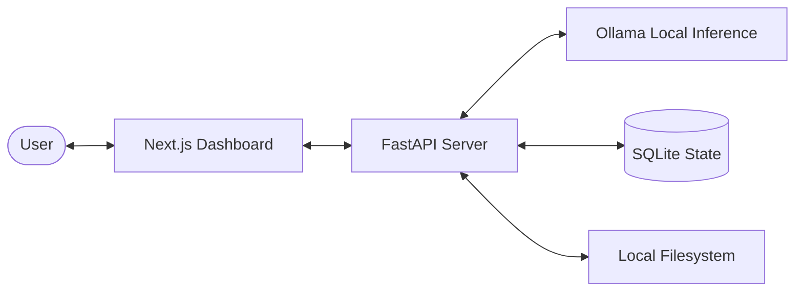
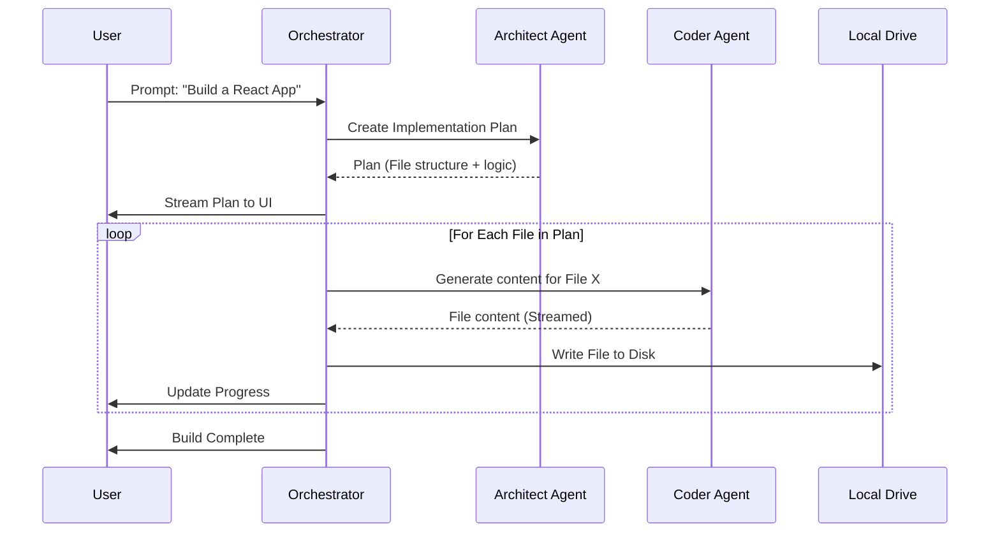
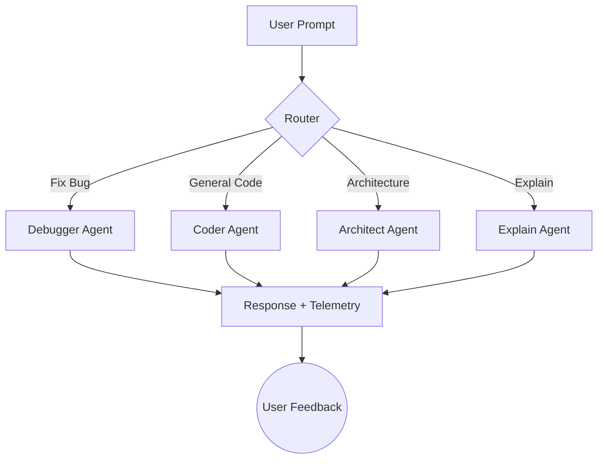

# 🚀 Cortex

> **The Fully Local, Privacy-First AI Coding Workstation.**  
> Cortex is a high-performance, multi-agent development environment designed to run 100% on your local machine. No cloud, no monthly bills, no data leaks. Just pure local intelligence.

---

## 🛠️ Core Capabilities

- **🧠 Multi-Agent Orchestration**: Specialized roles (Architect, Coder, Reviewer, Debugger) working in sync.
- **🛡️ 100% Local Intelligence**: Powered by **Ollama**. Your code never leaves your drive.
- **⚡ Two-Phase Build Pipeline**: Complex projects are first planned by an Architect agent, then executed by a Coder agent.
- **🔧 Built-In Refactoring**: Seamlessly refactor entire codebases using the integrated **Aider** engine.
- **🎙️ Advanced UX**: Web Speech API input, Stop-Generation control, and a real-time build monitor.
- **📊 Agent Telemetry**: Active feedback loops (thumbs up/down) to help the orchestrator learn from its mistakes.

---

## 🏗️ System Architecture

Cortex uses a decoupled **Double-N** architecture (Next.js + Node.js/Python).

### 📡 High-Level Overview


### ⚡ Build Cycle Phase (Architect → Coder)


### 💬 Chat Loop (Role-Routed)


---

## 🥊 Competitive Analysis

| Feature | Cortex | Cursor | GitHub Copilot | OpenAI Codex |
|---------|-----------------|--------|----------------|--------------|
| **Local/Private** | ✅ Yes (100%) | ❌ No | ❌ No | ❌ No |
| **Model Choice** | ✅ Any Ollama Model | ❌ Locked | ❌ Locked | ❌ Locked |
| **Full Build Pipeline**| ✅ (Architect+Coder) | ⚠ Partial | ❌ No | ✅ Yes |
| **Cost** | **$0 / Free** | $20/mo | $10/mo | $200/mo |
| **Multi-Agent Mode** | ✅ Yes | ❌ No | ❌ No | ❌ No |
| **Speech Input** | ✅ Yes | ❌ No | ❌ No | ❌ No |
| **Stop Generation** | ✅ Yes | ✅ Yes | ❌ No | ✅ Yes |
| **Open Source** | ✅ Yes | ❌ No | ❌ No | ❌ No |

---

## 🚀 Getting Started

### 📋 Prerequisites
1.  **Ollama**: [Download & Install](https://ollama.com/)
2.  **Node.js**: v18+ 
3.  **Python**: 3.10+
4.  **Hardware**: 16GB+ RAM recommended (for 14B+ models)

### ⚙️ Installation
1.  **Clone the Repo**:
    ```bash
    git clone https://github.com/Taitilchheda/Cortex.git
    cd Cortex
    ```
2.  **Automatic Setup**:
    Run the provided install script:
    ```bash
    ./INSTALL.bat
    ```

### ▶️ Running the App
Run both servers simultaneously:
```bash
./START.bat
```
- **Frontend**: [http://localhost:3000](http://localhost:3000)
- **Backend API**: [http://localhost:8000](http://localhost:8000)

---

## 📂 Project Structure

```text
Cortex/
├── dashboard/           # Next.js 16 Frontend
│   ├── app/             # Main Application Logic
│   │   ├── components/  # UI Elements (Chat, Sidebar, AgentOutput)
│   │   ├── lib/         # API Client & Shared Types
│   │   └── globals.css  # Premium Design System
│   └── public/          # Static Assets
├── server/              # FastAPI Backend
│   ├── agents/          # Core AI Orchestration Logic
│   ├── config/          # Model Routing & Recommendations
│   ├── api/             # SQLite State & Session Management
│   └── main.py          # Entry Point & SSE Streaming
└── START.bat            # One-click Launch Script
```

---

## 🗺️ Roadmap (v5.0)

We are currently transitioning from v4 to **Cortex v5.0**. Upcoming features include:
- [ ] **🧠 RAG Context Engine**: Local vector search for your entire codebase (ChromaDB).
- [ ] **📟 Integrated Terminal**: xterm.js terminal embedded in the dashboard.
- [ ] **📝 Monaco Code Editor**: Full VS Code-style editor in the file preview panel.
- [ ] **🔀 Git Integration**: Commit, branch, and diff management directly from the UI.
- [ ] **🧪 Test Runner**: Automated unit test execution and AI-assisted fixing.
- [ ] **🧩 Plugin System**: Extend the agent's capabilities with custom Python hooks.

---

## 📄 License
This project is licensed under the **MIT License**. Use it, fork it, build with it. It's free and always will be.

---

## ✨ Developed with ❤️ by Taitilchheda
*Making high-tier coding intelligence accessible to everyone.*