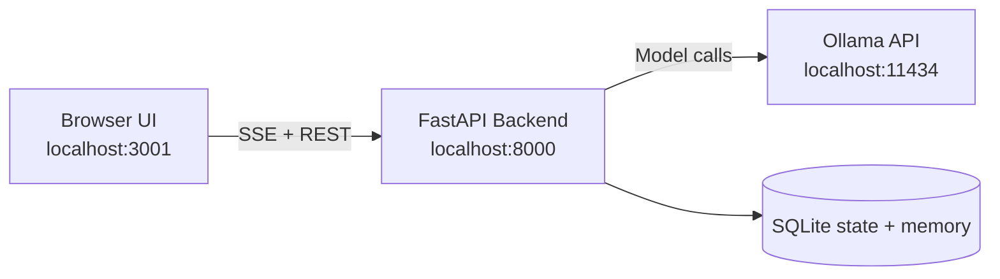
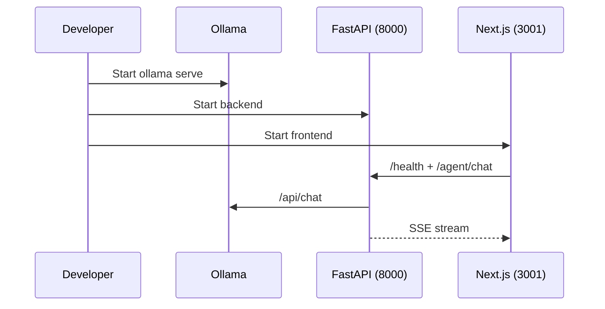

# Cortex Run Guide (Windows, macOS, Ubuntu)

This guide covers first-time setup, daily startup, and troubleshooting across all supported desktop platforms.

If you are new to Cortex, start with [USER_GUIDE.md](USER_GUIDE.md) first, then return here for platform-specific details.

## 1) Runtime Architecture

## 2) Prerequisites

- Ollama installed and reachable on port `11434`
- Python `3.10+`
- Node.js `18+` and npm
- Git

Quick checks:

- `python --version`
- `node --version`
- `npm --version`
- `curl http://localhost:11434/api/tags`

## 3) Startup Sequence

## 4) Windows

### 4.1 One-time setup

From repo root:

- `INSTALL.bat`

### 4.2 Run in dev mode

- `START_DEV.bat`

### 4.3 Run in production mode

- `START.bat`

### 4.4 Manual two-terminal mode

Terminal A:

1. `cd server`
2. `python -m uvicorn main:app --host 0.0.0.0 --port 8000 --reload`

Terminal B:

1. `cd dashboard`
2. `npm run dev -- -p 3001`

## 5) macOS

### 5.1 One-time setup

From repo root:

1. `cd server`
2. `python3 -m venv .venv`
3. `source .venv/bin/activate`
4. `pip install -r requirements.txt`
5. `cd ../dashboard`
6. `npm install`

### 5.2 Run

Terminal A:

1. `cd server`
2. `source .venv/bin/activate`
3. `uvicorn main:app --host 0.0.0.0 --port 8000 --reload`

Terminal B:

1. `cd dashboard`
2. `npm run dev -- -p 3001`

## 6) Ubuntu

### 6.1 Install system packages (if missing)

1. `sudo apt update`
2. `sudo apt install -y python3 python3-venv python3-pip nodejs npm git curl`

### 6.2 One-time setup

1. `cd server`
2. `python3 -m venv .venv`
3. `source .venv/bin/activate`
4. `pip install -r requirements.txt`
5. `cd ../dashboard`
6. `npm install`

### 6.3 Run

Terminal A:

1. `cd server`
2. `source .venv/bin/activate`
3. `uvicorn main:app --host 0.0.0.0 --port 8000 --reload`

Terminal B:

1. `cd dashboard`
2. `npm run dev -- -p 3001`

## 7) Verify Health

- Backend: `http://localhost:8000/health`
- Frontend: `http://localhost:3001`
- OpenAI-compatible endpoint: `http://localhost:8000/v1`

Expected backend indicators:

- `status: healthy`
- `ollama.status: connected`

## 8) Troubleshooting

### 8.1 Ollama disconnected

1. Start Ollama: `ollama serve`
2. Pull at least one model: `ollama pull qwen3-coder:latest`
3. Recheck `http://localhost:8000/health`

### 8.2 Dependency import errors

Backend:

1. `cd server`
2. Activate venv
3. `pip install -r requirements.txt`

Frontend:

1. `cd dashboard`
2. `npm install`

### 8.3 Port conflicts (8000/3001)

1. Stop old backend/frontend processes
2. Restart with the commands above
3. Verify only one backend and one frontend instance are active

### 8.4 Stale process behavior

If behavior does not match latest code, kill stale `uvicorn` or `next` processes and restart both services.
